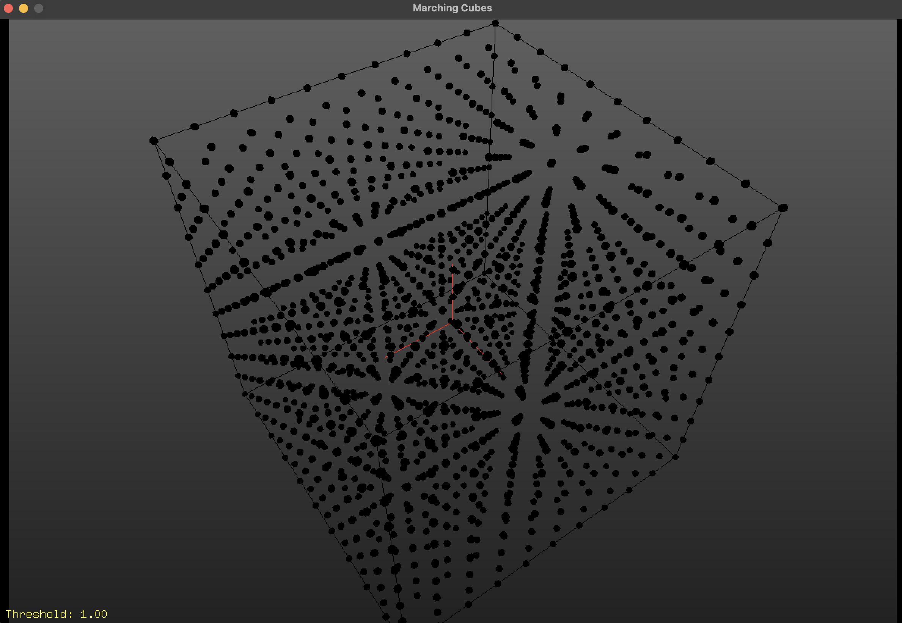
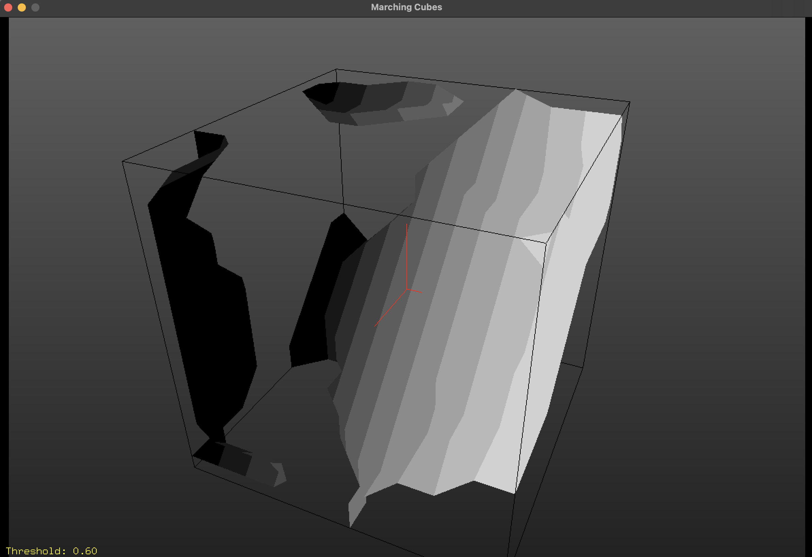

# Marching Cubes 3d

This is a Python3 project that implements the marching cubes algorithm for isosurface extraction.


<div style="text-align:center">
    
    
</div>

## Prerequisites
Before running the project, ensure you have the following installed:
- Python 3.x
- pip3


## Installation Steps
1. Clone the repository:
  ```bash
  git clone https://github.com/jhonatantft/marching-cubes-3d.git
  ```

2. Navigate to the project directory:
  ```bash
  cd marching_cubes
  ```

3. Run the Makefile to install dependencies using pip3:
  ```bash
  ./Makefile
  ```
   
  or

  ```bash
  pip3 install -r requirements.txt
  ```

4. Execute the project:
  ```bash
  python3 marching_cubes/app.py
  ```

## Usage
Once the project is running, you can interact with the marching cubes algorithm and visualize the isosurfaces in the 3D interface using the following controls:
- **ASWD:** Use these keys to move the marching cube within the 3D interface.
- **R:** Press 'R' to change the edge connections.
- **O:** Toggle to meshes by pressing 'O'.
- **P:** Toggle to points by pressing 'P'.
- **Mouse Movement:** Move the mouse up and down to change the threshold value dynamically.


## Additional Notes
- Make sure to have a compatible Python environment with pip3 installed.

## Contributors
- [Jhonatan Tomimatsu](https://github.com/jhonatantft)
